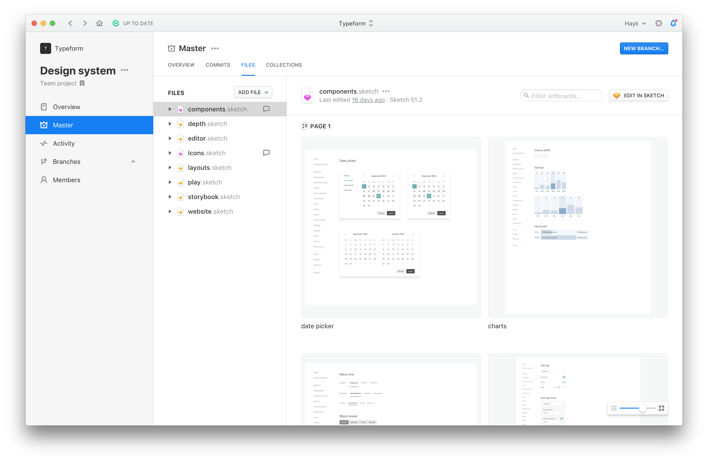
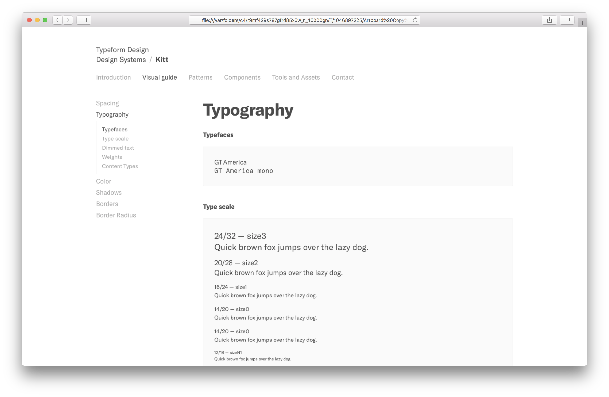
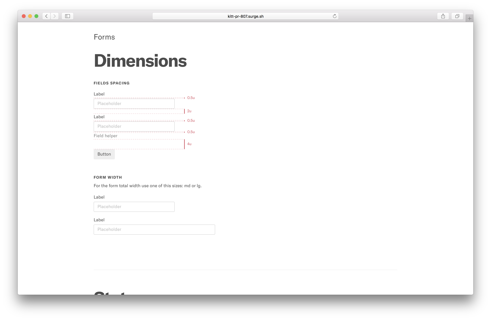

export { default as theme } from './theme'
import { Image } from 'mdx-deck'
import { Split, Invert } from 'mdx-deck/layouts'
import { Notes } from 'mdx-deck'

# Design System Session

  <Image src='images/kitt-bg.png' />

---

## Why are we building a design system?
# Speed, Consistency, Scalability

<Notes>
  This are not just our values, any well done design system should work like this.
</Notes>

---

# A bit of history
Since july/2017

<Notes>
  To understand the project that we are working on we have to look at what we did in the past.
</Notes>

---

<Image src='images/team-timeline.png' />

---

# All design system contributors
## Kitt and Sampler  

||||||
|-|:-:|:-:|:-:|:-:|
| fbaiodias | xarlio | lussn | edshadi | SaraiSan |
| denieler | gerardabello | Rheed | kirkov | joaojeronimo |
| josepmartins | mackermans | jepser | tpombeiro87 | |
| pchiwan | epallerols | EnnioDybeli | simondobson | |
| davesnx | enricolucia | danderu | LinusEkenstam | |
| carlesba | alexbassy | mbondyra | jordiponsllaurado | |

---

# Challenges

- There was no one source of truth for design
- Releasing V2 was the main company goal
- We wanted to build the design system without slowing down any other ptojects

---

<Image src='images/buttons.png' />

---

<Image src='images/colors.png' />

---

<Image src='images/shots-without-ds.png' />

---

<Image src='images/shots-with-ds.png' />

---

---

---

---

---

<!-- # A source of truth that contains design and development assets, tools and documentation to build our products -->

## The vision
# A source of truth that contains assets, tools and documentation to design and build our products.

---

# Design System team in Q3

  <Image src='images/kitt-bg.png' />

---

export default Split

# Offsite
**Goals**  
Set up milestones and team agreements

**Place**  
MOB

---

export default Split

  

  <h1>
    We had this burger
  </h1>
  

---

# Of course we also did a lot of stuff

_Define team name, write mission and purpose document for the team and project, clean old backlog and apply a new system in Trello with a document explaining new workflow._  
_Discuss documentation for front end engineers to help contribution, discuss controlled releases for better changelogs and help migration, write release process draft._  
_Discuss state of tooling around design systems, build process, storybook deployment and tech debt._  
_Run survey on front end hive, measure adoption in engineering teams. Define audit. What are we going to do with naming? Are we going to take care of tech debt? Should that be next big release task? Outcome should be a decision and a follow up meeting to define next steps. Public site for design system documentation?_  
_And more..._

---

# Design System team Notion page

---

---

# Milestones for Q3

- Create a centralized source of truth for design information.
  - Deliver first iteration of typeform.design site.
  - Create first set of design patterns to be consulted (forms and settings).
- Get to a 75% of test coverage in kitt components and utilities.
- Run audit to establish components that will become legacy, components that need refactor, and components that will remain as they are.
- Provide a full documented contribution guide for front end engineers.

---

# Create a centralized source of truth for design information

- Place where designers can checkout patterns already in use.
- Designs more connected to design system.
- Let’s friction for developers to implement designs.

---

# typeform.design

---

---
Check the website design progress in Abstract:  
Go to project __Design System__ and see the file __website__

Let us know what you think, what you would like to see in future iterations  
👉 #design-system in Slack

---

# Add unit tests to kitt

- Having basic set of tests will prevent bugs through big refactors.
- Us and other devs will feel more comfortable introducing changes knowing that we are not breaking other use cases.
- Let’s friction for developers to implement designs.

_
Spike and pick tooling  
Fix current coverage report to measure impact  
Internal workshop so all team members can contribute  
Write the tests
_

---

# Run audit on components

- Because of the fast pace around V2 release components contain inconsistencies around their API.
- Make components less predictable while being imported in projects.
- Lot of tech debt.

_
Go over all components and define list of actions  
Create tasks for next quarter to tackle on each  
Prepare migration path for developers  
Release major version with changes fully applied
_

---

# And more...
- New release process to improve changelogs and migrations. This helps us group features and fixes so teams don’t run behind so easily and manually write changes included on each version.
- Contributions guide for developers for bug fixing, deprecations and feature addition. This will eliminate some frustrations when contributing to the design system repositories.

---

# What we’ve already accomplished

---

# Sampler automatic deployment

---

---

# Visual guides and references in kitt for designers

---

---

---

# And more...

- Triple test coverage already.  
- Upgraded to React 16 and new react-transition-group package.  
- First design pattern in the writing.  
- Removed lots of deadcode in kitt.  
- Replace flowtype in favor of prop-types.  
- Already testing a new experimental Release process along with a draft explaining the process (Release guide draft).  
- First drafts for contribution guides for developers, reviewed by developers.  

---

# What's next

---

# Thanks
## Q&A
Alguna pregunta més?
